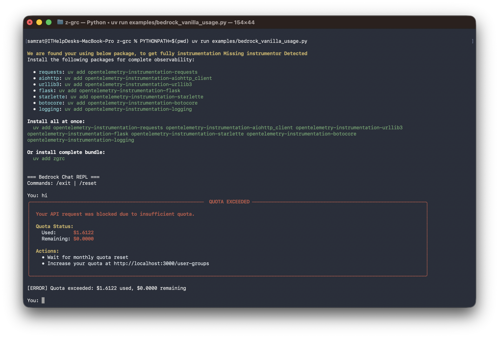
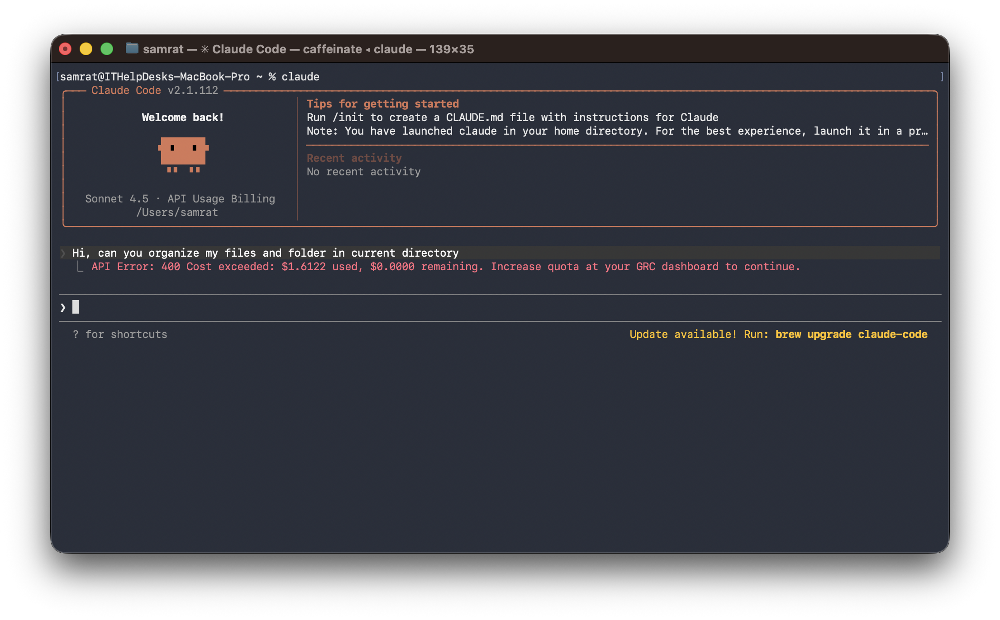
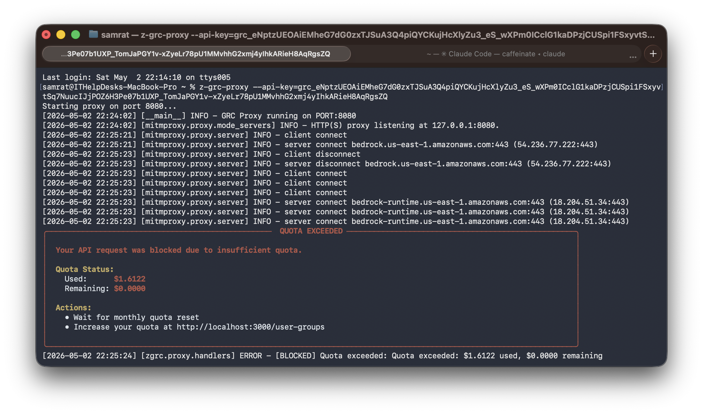

<p align="center">
  
</p>

<h2 align="center"><strong>Governance, Risk, and Control Engine for LLMs</strong></h2>
<p align="center">Built by <a href="https://zeb.ai">Zeb Labs</a></p>

<p align="center">

  <a href="https://pypi.org/project/z-grc/"></a>
  <a href="https://www.python.org/downloads/"></a>
  <a href="https://github.com/astral-sh/ruff"></a>
  <a href="https://zeb.ai"></a>
</p>

---

Enterprise-grade governance engine for Large Language Model applications. Provides automatic interception, policy enforcement, quota management, and comprehensive observability across multiple LLM providers with zero code changes.

## Installation

```bash
uv add z-grc
```

Or with auto-instrumentation:

```bash
uv add z-grc[auto-instrument]
```

## Quick Start

```python
import zgrc
import boto3
import json

# Initialize GRC
zgrc.init(api_key="your-zgrc-api-key")

# Use your LLM SDK normally - GRC handles everything
client = boto3.client("bedrock-runtime", region_name="us-east-1")

response = client.invoke_model(
    modelId="us.anthropic.claude-sonnet-4-5-20250929-v1:0",
    body=json.dumps({
        "anthropic_version": "bedrock-2023-05-31",
        "max_tokens": 1024,
        "messages": [{"role": "user", "content": "Hello!"}]
    })
)

# Z-GRC automatically:
# - Validates quota before requests
# - Tracks token usage
# - Enforces policies
# - Sends telemetry (traces, metrics, logs)
```

## Features

### Zero-Code Integration
Drop-in solution requiring only `zgrc.init()`. Works with existing code without modifications.

### Auto-Discovery
Automatically detects and intercepts installed LLM SDKs:
- AWS Bedrock (boto3)
- Anthropic (coming soon)
- OpenAI (coming soon)
- Azure OpenAI (coming soon)

### Policy Enforcement
Real-time quota validation and cost limit enforcement. Blocks requests when quota is exceeded.

```python
from zgrc.utils import QuotaExceededException

try:
    response = client.invoke_model(...)
except QuotaExceededException as e:
    print(f"Quota exceeded: ${e.used:.4f} used, ${e.remaining:.4f} remaining")
```

<p align="center">
  
</p>

### Auto-Instrumentation
Optional automatic instrumentation for HTTP clients, web frameworks, databases, and more:

```python
zgrc.init(
    api_key="your-zgrc-api-key",
    auto_instrument=True,
    app_name="my-app",
    environment="production"
)
```

### Framework Agnostic
Works with vanilla SDKs and popular frameworks:

```python
# PydanticAI
from pydantic_ai import Agent
agent = Agent("bedrock")
result = await agent.run("Your prompt")

# LangChain
from langchain_aws import ChatBedrock
llm = ChatBedrock(model_id="...")
response = llm.invoke("Your prompt")

# Strands Agents
from strands_agents import Agent
agent = Agent(provider="bedrock")
response = agent.execute("Your prompt")
```

### Streaming Support
Fully supports streaming responses with automatic token tracking:

```python
response = client.converse_stream(
    modelId="...",
    messages=[{"role": "user", "content": [{"text": "Tell me a story"}]}]
)

for event in response["stream"]:
    if "contentBlockDelta" in event:
        print(event["contentBlockDelta"]["delta"]["text"], end="")
```

## Configuration

```python
zgrc.init(
    api_key: str,                  # Your Z-GRC API key (required)
    auto_instrument: bool = False, # Enable auto-instrumentation
    app_name: str = None,          # Application name for telemetry
    environment: str = None,       # Environment (dev/staging/prod)
    log_level: int = logging.ERROR # Z-GRC internal log level
)
```

## Proxy Mode (Claude Code CLI)

For environments where code modification isn't possible (like Claude Code CLI), use the standalone proxy:

### Quick Start

**Background Mode (Recommended):**

In the same terminal, run both commands:

```bash
# Step 1: Start proxy in background and set environment variables
eval $(z-grc-proxy --api-key=your-key -d)

# Step 2: Run Claude Code in the same terminal
claude
```

<p align="center">
  
  <br>
  <em>Claude Code running with Z-GRC proxy in background mode</em>
</p>

> **Note:** You need to run the `eval $(z-grc-proxy ...)` command in every new terminal where you want to use Claude Code with Z-GRC. The environment variables only apply to the current terminal session.

**Foreground Mode:**

**Terminal 1** - Start the proxy (shows logs):
```bash
z-grc-proxy --api-key=your-key
```

<p align="center">
  
  <br>
  <em>Proxy server running in foreground with request logs</em>
</p>

**Terminal 2** - Open another tab, set environment variables, and run Claude:
```bash
export HTTPS_PROXY=http://127.0.0.1:8080
export NODE_EXTRA_CA_CERTS=~/.mitmproxy/mitmproxy-ca-cert.pem
claude
```

> **Note:** In foreground mode, the proxy runs in Terminal 1 and shows live logs. Claude Code runs in Terminal 2 with the environment variables set to use the proxy.

### Proxy Commands

```bash
# Start in background (auto port detection)
eval $(z-grc-proxy --api-key=your-key -d)

# Start on specific port
eval $(z-grc-proxy --api-key=your-key --port=8085 -d)

# Check active proxy sessions
z-grc-proxy --status

# Kill all proxy servers
z-grc-proxy --kill-all

# Verbose logging
eval $(z-grc-proxy --api-key=your-key -d --verbose)
```

### How It Works

1. **Automatic Port Detection**: Finds available port (8080-8090)
2. **Session Management**: Reuses existing proxy for same API key
3. **mitmproxy Certificates**: Auto-generated in `~/.mitmproxy/` on first run
4. **Platform Independent**: Works on macOS, Linux, Windows

### Building Executables

Build standalone proxy binary with PyInstaller:

```bash
# Current platform only
make grpc-proxy-build
```

Output: `dist/z-grc-proxy`

### Test Binary
```bash
# Background mode
eval $(./dist/z-grc-proxy --api-key=your-key -d)

# Foreground mode
./dist/z-grc-proxy --api-key=your-key
```

## Installing Executor

### macOS / Linux
```bash
curl -fsSL https://raw.githubusercontent.com/zeb-ai/z-grc/main/install.sh | bash
```

### Windows (PowerShell)
```powershell
irm https://raw.githubusercontent.com/zeb-ai/z-grc/main/install.ps1 | iex
```
