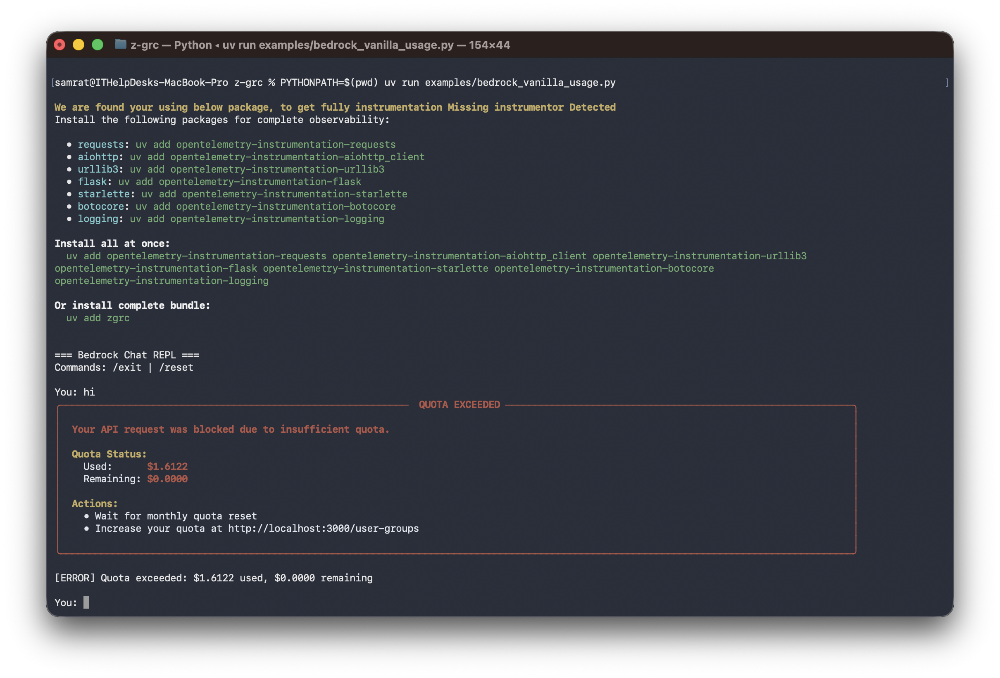

<p align="center">
  
</p>

<h2 align="center"><strong>Governance, Risk, and Control Engine for LLMs</strong></h2>
<p align="center">Built by <a href="https://zeb.ai">Zeb Labs</a></p>

<p align="center">
  <a href="https://pypi.org/project/z-grc/"></a>
  <a href="https://www.npmjs.com/package/@zeb_labs/zgrc"></a>
  <a href="https://www.python.org/downloads/"></a>
  <a href="https://nodejs.org/"></a>
  <a href="LICENSE"></a>
</p>

---

Enterprise-grade governance engine for Large Language Model applications. Provides automatic interception, policy enforcement, quota management, and comprehensive observability across multiple LLM providers with zero code changes.

Built with a high-performance native C core and bindings for Python and Node.js, Z-GRC intercepts LLM API calls at the network level, enabling seamless integration with any LLM SDK or framework.

## Installation

### Python

```bash
pip install z-grc
```

### Node.js

```bash
npm install @zeb_labs/zgrc
```

## Quick Start

### Python - AWS Bedrock

```python
import zgrc
import boto3
import json

# Initialize Z-GRC
zgrc.init(api_key="your-zgrc-api-key")

# Use AWS Bedrock SDK normally - Z-GRC handles everything
client = boto3.client("bedrock-runtime", region_name="us-east-1")

response = client.invoke_model(
    modelId="us.anthropic.claude-sonnet-4-5-20250929-v1:0",
    body=json.dumps({
        "anthropic_version": "bedrock-2023-05-31",
        "max_tokens": 1024,
        "messages": [{"role": "user", "content": "Hello!"}]
    })
)

# Z-GRC automatically:
# - Validates quota before requests
# - Tracks token usage and calculates costs
# - Enforces policies
# - Sends telemetry (traces, metrics, logs)
```

### Python - OpenAI

```python
import zgrc
from openai import OpenAI

# Initialize Z-GRC
zgrc.init(api_key="your-zgrc-api-key")

# Use OpenAI SDK normally
client = OpenAI(api_key="your-openai-key")

response = client.chat.completions.create(
    model="gpt-4",
    messages=[{"role": "user", "content": "Hello!"}]
)
```

### Node.js - AWS Bedrock

```javascript
const zgrc = require("@zeb_labs/zgrc");
const {
  BedrockRuntimeClient,
  InvokeModelCommand,
} = require("@aws-sdk/client-bedrock-runtime");

// Initialize Z-GRC
zgrc.init({ apiKey: "your-zgrc-api-key" });

// Use AWS SDK normally
const client = new BedrockRuntimeClient({ region: "us-east-1" });

const response = await client.send(
  new InvokeModelCommand({
    modelId: "us.anthropic.claude-sonnet-4-5-20250929-v1:0",
    body: JSON.stringify({
      anthropic_version: "bedrock-2023-05-31",
      max_tokens: 1024,
      messages: [{ role: "user", content: "Hello!" }],
    }),
  }),
);
```

### Node.js - OpenAI

```javascript
const zgrc = require("@zeb_labs/zgrc");
const OpenAI = require("openai");

// Initialize Z-GRC
zgrc.init({ apiKey: "your-zgrc-api-key" });

// Use OpenAI SDK normally
const client = new OpenAI({ apiKey: "your-openai-key" });

const response = await client.chat.completions.create({
  model: "gpt-4",
  messages: [{ role: "user", content: "Hello!" }],
});
```

Streaming is fully supported with automatic token tracking.

## Features

### Zero-Code Integration

Drop-in solution requiring only `zgrc.init()`. Works with existing code without modifications.

### Auto-Discovery

Automatically detects and intercepts installed LLM SDKs:

- AWS Bedrock (boto3)
- OpenAI (including Azure OpenAI, Databricks, and OpenAI-compatible endpoints)
- Anthropic (coming soon)

### Policy Enforcement

Real-time quota validation and cost limit enforcement. Blocks requests when quota is exceeded.

<p align="center">
  
</p>

### Framework Agnostic

Works with vanilla SDKs and popular frameworks:

```python
# PydanticAI
from pydantic_ai import Agent
agent = Agent("bedrock")
result = await agent.run("Your prompt")

# LangChain
from langchain_aws import ChatBedrock
llm = ChatBedrock(model_id="...")
response = llm.invoke("Your prompt")

# Strands Agents
from strands_agents import Agent
agent = Agent(provider="bedrock")
response = agent.execute("Your prompt")
```

## Supported Providers

| Provider                 | Python | Node.js | Streaming |
| ------------------------ | ------ | ------- | --------- |
| AWS Bedrock              | Yes    | Yes     | Yes       |
| OpenAI                   | Yes    | Yes     | Yes       |
| Azure OpenAI             | Yes    | Yes     | Yes       |
| Anthropic                | WIP    | WIP     | WIP       |
| Custom OpenAI-compatible | Yes    | Yes     | Yes       |

> **Note:** Older versions included a CLI proxy controller for environments where code modification isn't possible. This feature is currently WIP for the v2 rewrite.

## Development

### Building from Source

```bash
# Clone the repository
git clone https://github.com/zeb-ai/z-grc.git
cd z-grc

# Build Python package
cd packages/python
pip install -e .

# Build Node.js package
cd packages/node
npm install
npm run build

# Run tests (C core)
mkdir build && cd build
cmake ..
make
./test_interceptor
```

## License

This project is licensed under the MIT License - see the [LICENSE](LICENSE) file for details.

---

<p align="center">
  Made by <a href="https://zeb.ai">Zeb Labs</a>
</p>
